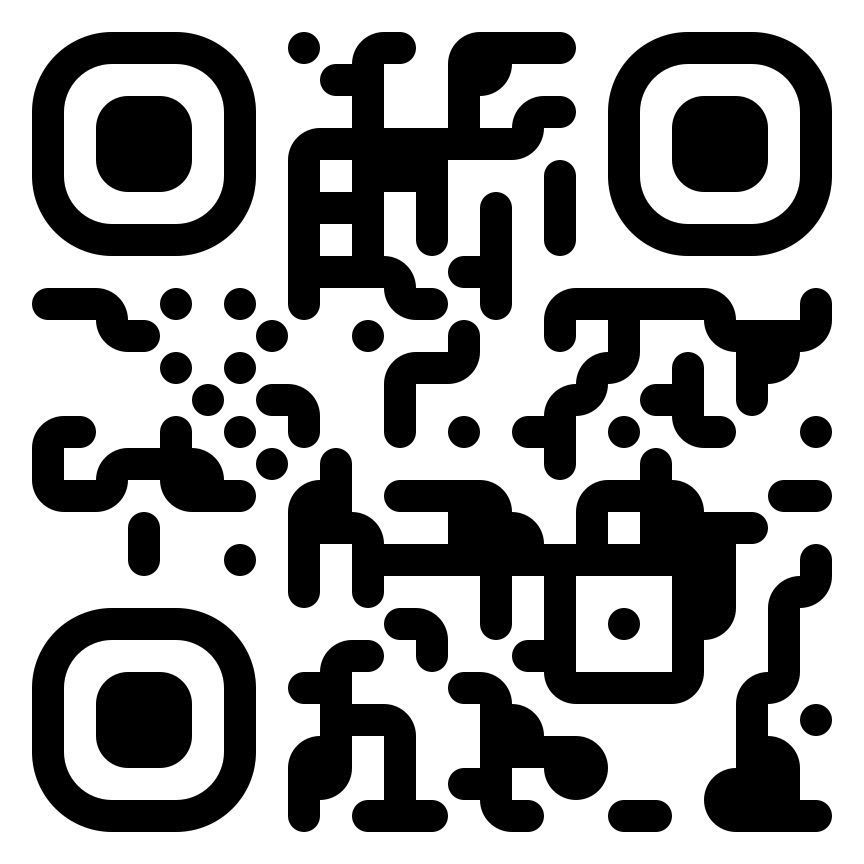
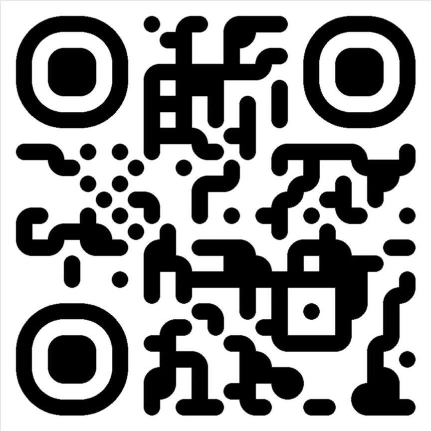

# Welcome

[](https://badge.fury.io/py/qrcode-styled) [](https://codecov.io/gh/AdamBrianBright/qrcode_styled) [](https://app.fossa.com/projects/git%2Bgithub.com%2FAdamBrianBright%2Fqrcode_styled?ref=badge_shield)

## QRCode Styled [\[WIP\]](https://dictionary.cambridge.org/us/dictionary/english/wip?q=WIP)


This is a python port for a [browser QRCode generator](https://github.com/kozakdenys/qr-code-styling)
by [Denys Kozak](https://github.com/kozakdenys)

This project was initially created for internal use in [cifrazia.com](https://cifrazia.com/).

We do not intend to maintain this project for wide usage, but feel free to use it, share, edit or submit pull requests.

## Features

+ Multiple formats:
   + [x] SVG using `xmls`
   + [x] PNG/WEBP, etc. using `Pillow`
+ Multiple styles:
   + [x] Extra rounded corners
   + [ ] Rounded corners
   + [ ] Straight
   + [ ] Dotted

Check out [our documentation](https://adambrianbright.github.io/qrcode_styled/get-started/).

## Installing

Using **Poetry**

```shell
poetry add qrcode-styled
```

Using **PIP**

```shell
pip install qrcode-styled
```

### Requirements

+ Python `>= 3.9`
+ Pillow `>= 8.2.0`
+ qrcode `>= 6.1`
+ lxml `>= 8.2.0` (optional, for SVG rendering)

### Extras

| Keyword | Description                | Packages        |
| ------- | -------------------------- | --------------- |
| `svg`   | Allows you to generate SVG | `lxml >= 4.6.3` |

| SVG                           | WEBp                           |
| ----------------------------- | ------------------------------ |
|  |  |

## Usage

:::code source="./code/get-started.py" :::

[](https://app.fossa.com/projects/git%2Bgithub.com%2FAdamBrianBright%2Fqrcode_styled?ref=badge_large)